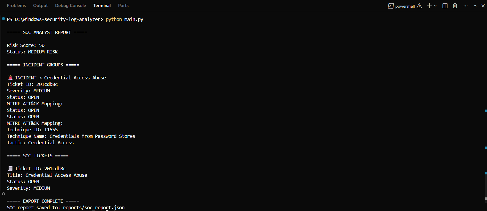
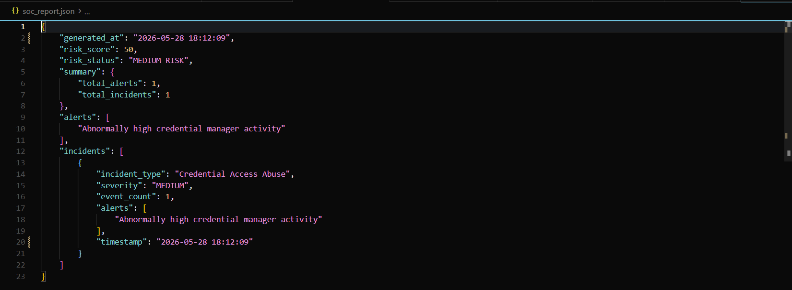

# 🛡️ Windows Security Log Analyzer — SOC Simulation Project


---

## 📌 Overview

The **Windows Security Log Analyzer** is a SOC (Security Operations Center) simulation project built in Python. It replicates core SOC analyst workflows by ingesting Windows Security logs, detecting suspicious activity, correlating incidents, assigning tickets, mapping attack techniques to MITRE ATT&CK, and generating structured security reports.

> This project demonstrates practical SOC analyst skills including threat detection, incident response, and security event correlation.

---

## 🎯 Key Features

| Feature | Description |
|---|---|
| 🔍 Log Ingestion | Reads and processes Windows Security Event Logs |
| 🚨 Threat Detection | Identifies brute force, credential access, and privilege escalation |
| 🧠 Incident Correlation | Groups related alerts into structured incidents |
| 🧾 SOC Ticketing | Converts incidents into tracked SOC-style tickets |
| 🧭 MITRE ATT&CK Mapping | Maps detected activity to MITRE techniques |
| 📊 Report Generation | Exports structured JSON security reports |

---

## 🏗️ Architecture

```
Windows Logs → Analyzer → Alerts → Incident Correlation → Ticket System → MITRE Mapping → JSON Report
```

---

## 📁 Project Structure

```
windows-security-log-analyzer/
│
├── main.py                  # SOC workflow entry point
├── requirements.txt         # Dependencies
├── README.md                # Project documentation
│
├── src/
│   ├── log_reader.py        # Windows log ingestion
│   ├── analyzer.py          # Detection engine
│   ├── risk_engine.py       # Risk scoring system
│   ├── incident_grouper.py  # Incident correlation logic
│   ├── ticket_system.py     # SOC ticketing system
│   ├── mitre_mapper.py      # MITRE ATT&CK mapping
│   └── report_exporter.py   # JSON report generation
│
├── data/                    # Input logs (sample data)
├── reports/                 # Generated SOC reports
└── utils/                   # Helper utilities
```

---

## 🚀 Getting Started

### 1. Clone the repository

```
git clone https://github.com/your-username/windows-security-log-analyzer.git
cd windows-security-log-analyzer
```

### 2. Install dependencies

```
pip install -r requirements.txt
```

### 3. Run the analyzer

```
python main.py
```

---

## 📊 Example Output

```
Risk Score : 78 — HIGH RISK
Alerts     : 14 suspicious events detected
Incidents  : 3 correlated incident groups
Tickets    : 3 SOC tickets generated (OPEN)
MITRE      : T1110, T1078, T1068 mapped
Report     : reports/soc_report_2024.json exported
```

---

## 🧭 MITRE ATT&CK Coverage

| Technique ID | Name | Category |
|---|---|---|
| T1110 | Brute Force | Credential Access |
| T1078 | Valid Accounts | Defense Evasion / Persistence |
| T1068 | Exploitation for Privilege Escalation | Privilege Escalation |

---

## 🧠 SOC Skills Demonstrated

- ✅ Windows Security log analysis
- ✅ Threat detection engineering
- ✅ Incident correlation and grouping
- ✅ SOC ticket lifecycle management
- ✅ MITRE ATT&CK framework application
- ✅ Structured security reporting and documentation

---

## 📌 Use Cases

This project is designed for:

- 🎯 SOC Analyst portfolio development
- 📚 Cybersecurity learning and practice
- 🖥️ SIEM-style detection simulation
- 💼 Interview demonstrations and assessments

---

## 📸 Screenshots

### SOC Analysis Output



---

### JSON SOC Report



---

## ⚠️ Disclaimer

This project is intended for **educational and SOC training simulation purposes only**. It does not interact with any real or production security systems.
